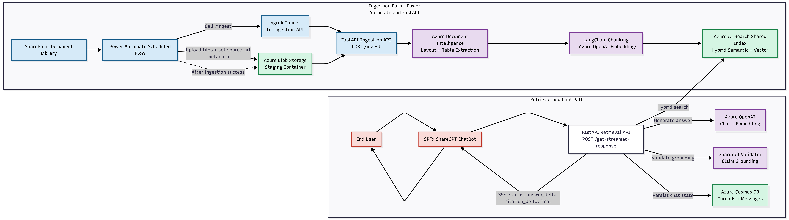
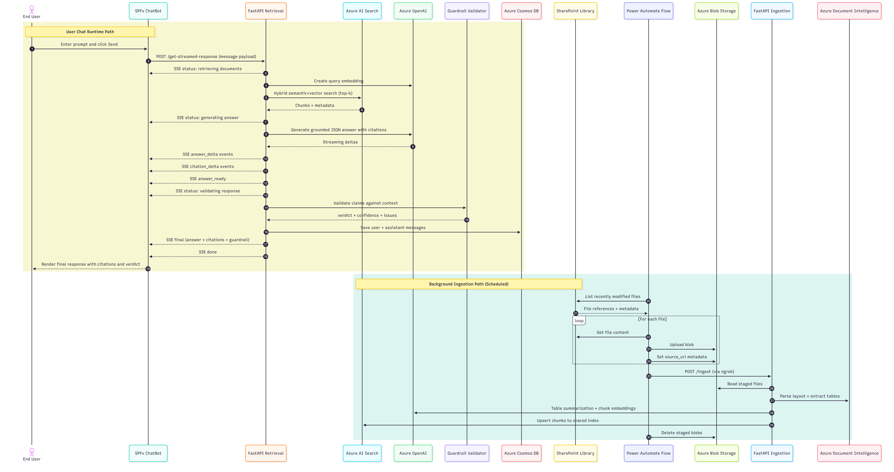

# ShareGPT: RAG Chatbot for SharePoint

ShareGPT is an enterprise chatbot that answers company-specific questions using Retrieval-Augmented Generation (RAG).

It combines:
- SharePoint as knowledge source
- Power Automate for ingestion orchestration
- FastAPI for ingestion/retrieval APIs
- Azure AI services for indexing + generation
- SPFx for SharePoint/Teams chat UX

## Tech stack


## Solution overview

### Core modules

- `ingestion/`:
  - FastAPI ingestion service
  - receives flow-triggered `/ingest` calls
  - creates and maintains Azure AI Search index
- `retrieval/`:
  - chat + retrieval API
  - hybrid semantic-vector search
  - answer generation + guardrail validation
  - Cosmos DB chat persistence
- `ChatBot/`:
  - SPFx frontend for SharePoint/Teams
  - streaming response rendering
  - citations and guardrail verdict display
  - browser dictation input
- `power-automate-export/`:
  - exported managed Power Automate solution for ingestion preprocessing

### End-to-end flow

#### A. Ingestion flow (Power Automate + FastAPI) - required
1. Power Automate job runs at interval.
2. It reads recently modified files from SharePoint library.
3. It uploads files to Azure Blob staging container.
4. It sets blob metadata `source_url` from SharePoint link.
5. It calls ingestion API `POST /ingest`.
6. Ingestion API:
   - reads staged blobs
   - parses with Document Intelligence
   - chunks content using LangChain splitter
   - generates embeddings
   - replaces existing chunks for same `source_url`
   - uploads chunks to Azure AI Search
7. Flow clears staged blobs after successful ingestion.

#### B. Retrieval + chat flow
1. SPFx sends chat payload to retrieval API (`/get-streamed-response`).
2. Retrieval API performs hybrid semantic-vector search in Azure AI Search.
3. LLM generates grounded answer in JSON format with citations.
4. Guardrail validator scores grounding and issues verdict.
5. Messages + final response are stored in Cosmos DB.
6. UI shows answer, citations, and guardrail details.

## Repository structure

- `ingestion/`
- `retrieval/`
- `ChatBot/`
- `demo-files/`
- `power-automate-export/ShareGPT_1_0_0_1_managed.zip`

## Architecture diagrams

### Architecture Flow:



### Sequence Diagram:


## Prerequisites

### Local tools
- Python 3.13.x
- Node.js `>=22.14.0 <23.0.0`
- npm
- ngrok CLI
- SharePoint Framework local setup prerequisites
- Postman or equivalent API client (optional but recommended)

### Azure resources
- Azure AI Search
- Azure OpenAI (embedding + chat deployments)
- Azure Document Intelligence
- Azure Storage Account (Blob)
- Azure Cosmos DB (database + container)

## Step 0: Clone repository

```powershell
git clone https://github.com/msoumit/share-gpt.git
cd share-gpt
```

## Step 1: Create Azure resources

1. Create Blob container (example `container-share-gpt`) for staged ingestion files.
2. Create Azure AI Search service.
3. Create Azure OpenAI resource and deploy:
   - 1 embedding model (1536 dim)
   - 1 chat model
4. Create Azure Document Intelligence resource.
5. Create Cosmos DB database and container for chat history.

Important:
- AI Search service creation is not enough.
- You must call `POST /create-index` once (Step 3) to create required schema/vector/semantic config.

## Step 2: Configure environment variables

Create `.env` files from templates:

```powershell
Copy-Item ingestion\example_env.txt ingestion\.env
Copy-Item retrieval\example_env.txt retrieval\.env
```

Then set real values in:
- `ingestion/.env`
- `retrieval/.env`

## Step 3: Run ingestion API (local)

```powershell
cd ingestion
python -m venv .venv
.\.venv\Scripts\Activate.ps1
pip install -r requirements.txt
uvicorn main:app --host 0.0.0.0 --port 8001 --reload
```

Required one-time call before first flow run:

```http
POST http://localhost:8001/create-index
```

Notes:
- `POST /ingest` is normally called by Power Automate, not manually.
- `POST /clear-index` is maintenance-only.

## Step 4: Run Power Automate ingestion preprocessing (required)

### 4.1 Import flow solution
Import package:
- `power-automate-export/ShareGPT_1_0_0_1_managed.zip`

### 4.2 Configure flow variables
Set environment values for:
- SharePoint site URL
- SharePoint library ID
- ngrok ingestion base URL
- ingestion method path (`/ingest`)

### 4.3 Expose ingestion API via ngrok

```powershell
ngrok http 8001
```

Use generated HTTPS URL in flow environment variable.

### 4.4 Validate flow run
Expected successful run behavior:
- gets files from SharePoint
- uploads to Blob
- sets `source_url` metadata
- calls `/ingest`
- deletes staged blobs

## Step 5: Run retrieval API (local)

```powershell
cd retrieval
python -m venv .venv
.\.venv\Scripts\Activate.ps1
pip install -r requirements.txt
uvicorn main:app --host 0.0.0.0 --port 8000 --reload
```

Basic checks:

```http
GET  http://localhost:8000/
POST http://localhost:8000/sample-test
```

Expected:

```json
{"response":"hello world v2"}
```

```json
{"response":"sample test successful"}
```

## Step 6: Run SPFx frontend

```powershell
cd ChatBot
npm install -g @rushstack/heft
npm install
heft start
```

Set web part properties:
- `chatAPI` (example `http://127.0.0.1:8000`)
- `introductionMessage`
- `sidebarDisclaimer`
- `description` (optional)

## API contracts

## Ingestion API (`ingestion/main.py`)

### `POST /create-index`
- Purpose: create/update AI Search index schema.
- Body: none.
- Success: index creation response from AI Search.
- Failure:

```json
{
  "error": "failed to create search index",
  "details": "<exception>"
}
```

### `POST /ingest`
- Purpose: run ingestion pipeline on staged blobs.
- Called by: Power Automate flow.
- Body: none.
- Failure:

```json
{
  "error": "failed to ingest documents",
  "details": "<exception>"
}
```

### `POST /clear-index`
- Purpose: delete all docs from index (maintenance).

## Retrieval API (`retrieval/main.py`)

### Thread/message management

#### `POST /read-chat-threads`
Request:

```json
{
  "userEmail": "user@contoso.com",
  "type": "CHAT_THREAD"
}
```

#### `POST /create-chat-threads`
Request:

```json
{
  "id": "thread-guid",
  "userEmail": "user@contoso.com",
  "userName": "User Name",
  "name": "new chat",
  "createdAt": "2026-03-10T12:00:00Z",
  "type": "CHAT_THREAD"
}
```

#### `POST /update-chat-threads`
Request:

```json
{
  "id": "thread-guid",
  "userEmail": "user@contoso.com",
  "name": "Updated thread name"
}
```

#### `POST /delete-chat-threads`
Request:

```json
{
  "id": "thread-guid",
  "userEmail": "user@contoso.com"
}
```

Returns `204 No Content` on success.

#### `POST /read-chat-messages`
Request:

```json
{
  "userEmail": "user@contoso.com",
  "threadId": "thread-guid",
  "type": "CHAT_MESSAGE"
}
```

### Non-streamed response (Maintenance only)

#### `POST /get-response`
Minimum request:

```json
{
  "content": "What is our leave policy?"
}
```

SPFx sends full chat message object (includes `userEmail`, `threadId`, etc.) so retrieval can persist user+assistant messages in Cosmos DB.

Response contract:

```json
{
  "answer": "string",
  "citations": [
    {
      "title": "string",
      "sourceUrl": "string",
      "chunkId": "string"
    }
  ],
  "guardrail": {
    "verdict": "grounded | partially_grounded | not_grounded | unknown",
    "confidence": 0.0,
    "issues": [],
    "notes": null
  }
}
```

### Streamed response (SSE)

#### `POST /get-streamed-response`
Request:

```json
{
  "content": "What are the reimbursement rules?",
  "userEmail": "user@contoso.com",
  "userName": "User Name",
  "threadId": "thread-guid",
  "type": "CHAT_MESSAGE",
  "role": "user",
  "id": "message-guid",
  "createdAt": "2026-03-10T12:00:00Z"
}
```

SSE events emitted:
- `status` (`retrieving documents`, `generating answer`, `validating response`)
- `answer_delta`
- `citation_delta`
- `answer_ready`
- `final`
- `done`
- `error`

## Troubleshooting

### Flow cannot trigger ingestion
- Ensure ngrok session for port `8001` is active.
- Ensure flow environment variables point to current ngrok URL.
- Ensure ingestion API is running locally.

### Ingestion errors
- Verify AI Search endpoint/admin key/index.
- Verify Blob connection string/container.
- Verify Document Intelligence endpoint/key/model.
- Verify OpenAI endpoint/key/deployments.

### Retrieval errors
- Ensure retrieval uses same search index as ingestion.
- Ensure Cosmos endpoint/key/database/container are valid.
- Check response logs for guardrail parsing errors.

### SPFx cannot chat
- Ensure web part `chatAPI` points to `retrieval` API base URL.
- Ensure CORS is not blocked.

## Acknowledgements

This project was built by:
- Soumit Mukherjee
- Sourav Paul

We acknowledge the support of Microsoft SharePoint, Power Automate, and Azure AI services used in this solution.

## License

This project is licensed under the MIT License. See [LICENSE](./LICENSE) for details.
