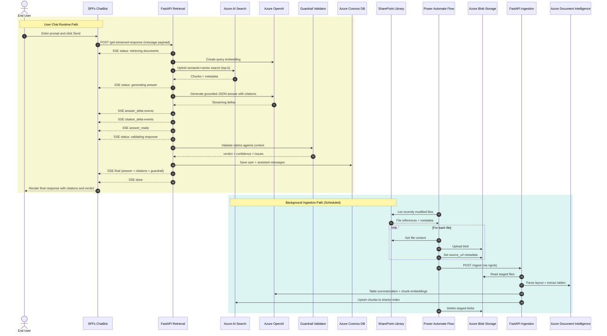

# ShareGPT Sequence Diagram

```mermaid
sequenceDiagram
    autonumber
    actor U as End User
    participant SPFX as SPFx ChatBot
    participant RET as FastAPI Retrieval
    participant SRCH as Azure AI Search
    participant OAI as Azure OpenAI
    participant GR as Guardrail Validator
    participant COS as Azure Cosmos DB

    rect rgb(247, 247, 210)
        note over U,SPFX: User Chat Runtime Path
        U->>SPFX: Enter prompt and click Send
        SPFX->>RET: POST /get-streamed-response (message payload)
        RET-->>SPFX: SSE status: retrieving documents
        RET->>OAI: Create query embedding
        RET->>SRCH: Hybrid semantic+vector search (top-k)
        SRCH-->>RET: Chunks + metadata
        RET-->>SPFX: SSE status: generating answer
        RET->>OAI: Generate grounded JSON answer with citations
        OAI-->>RET: Streaming deltas
        RET-->>SPFX: SSE answer_delta events
        RET-->>SPFX: SSE citation_delta events
        RET-->>SPFX: SSE answer_ready
        RET-->>SPFX: SSE status: validating response
        RET->>GR: Validate claims against context
        GR-->>RET: verdict + confidence + issues
        RET->>COS: Save user + assistant messages
        RET-->>SPFX: SSE final (answer + citations + guardrail)
        RET-->>SPFX: SSE done
        SPFX-->>U: Render final response with citations and verdict
    end

    participant SPP as SharePoint Library
    participant PAF as Power Automate Flow
    participant BLOB as Azure Blob Storage
    participant ING as FastAPI Ingestion
    participant DI as Azure Document Intelligence

    rect rgb(220, 245, 240)
        note over SPP,SRCH: Background Ingestion Path (Scheduled)
        PAF->>SPP: List recently modified files
        SPP-->>PAF: File references + metadata
        loop For each file
            PAF->>SPP: Get file content
            PAF->>BLOB: Upload blob
            PAF->>BLOB: Set source_url metadata
        end
        PAF->>ING: POST /ingest (via ngrok)
        ING->>BLOB: Read staged files
        ING->>DI: Parse layout + extract tables
        ING->>OAI: Table summarization + chunk embeddings
        ING->>SRCH: Upsert chunks to shared index
        PAF->>BLOB: Delete staged blobs
    end
```

